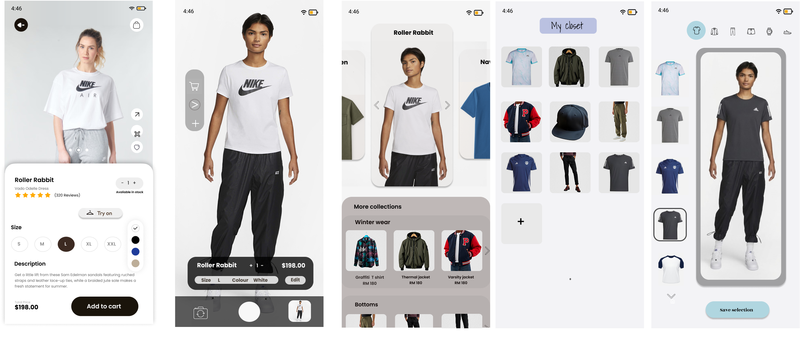
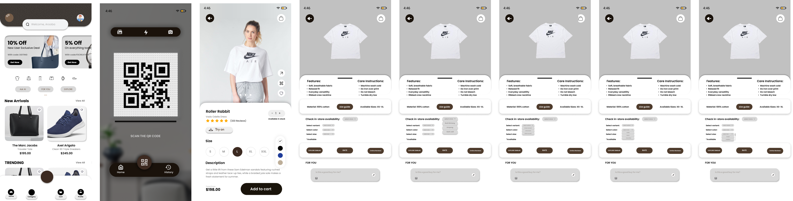
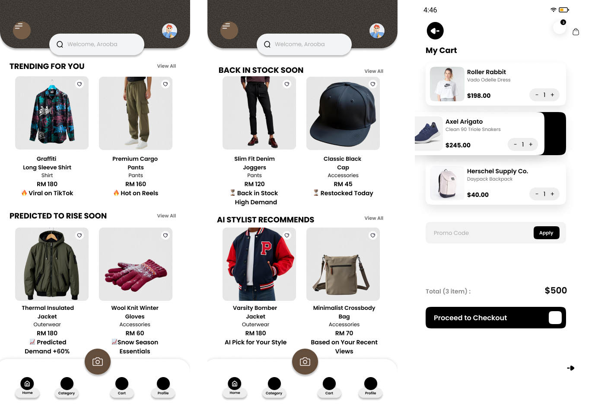
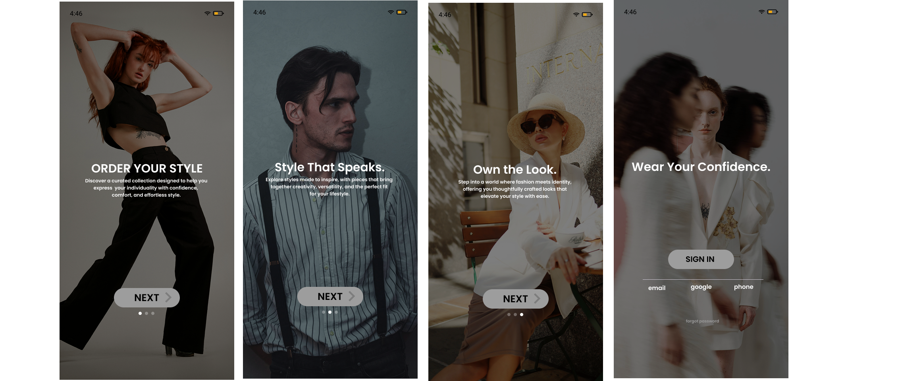
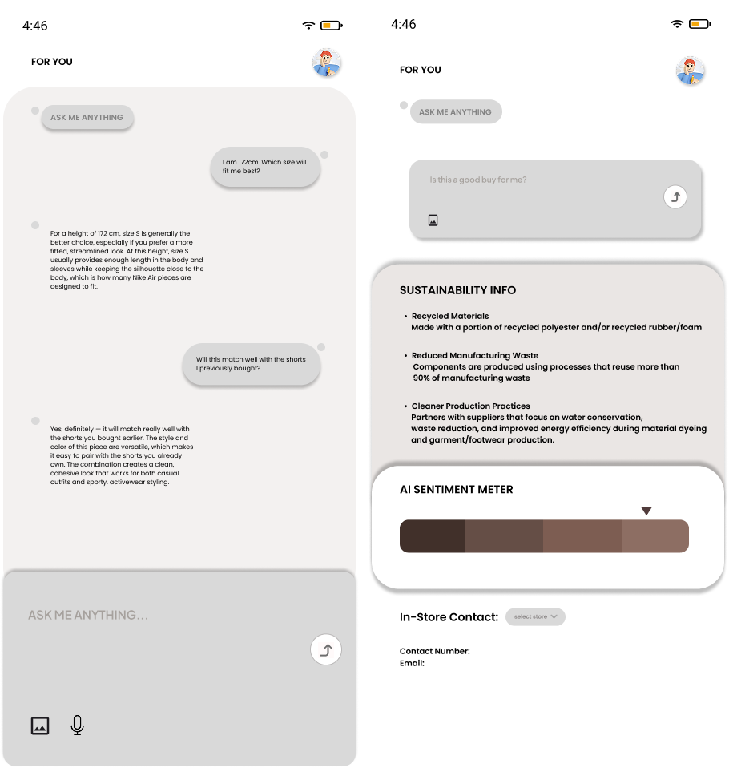
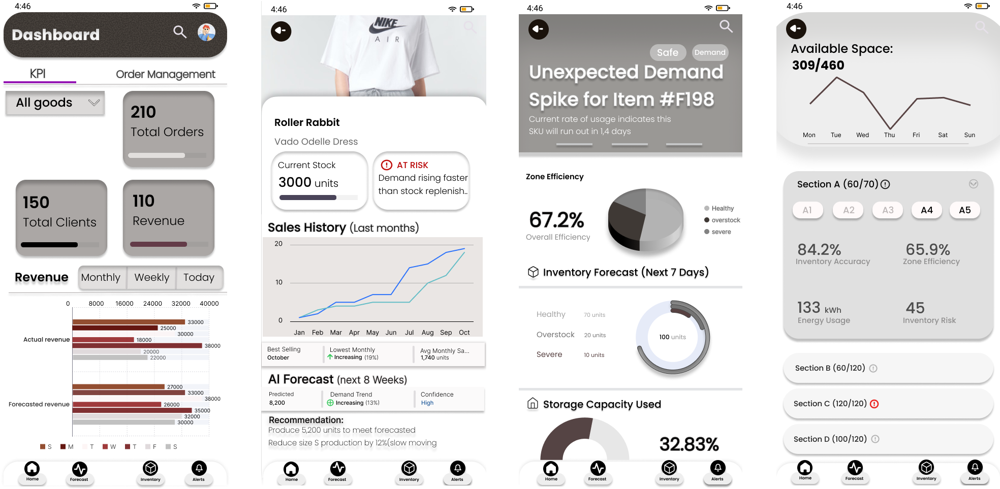

# Fashion E-Commerce Prototype

A high-fidelity fashion e-commerce mobile application prototype designed in Figma.

The prototype explores a modern shopping experience that combines e-commerce functionality with AI-powered recommendations, virtual try-on, QR-based product information, sustainability insights, and intelligent inventory management.

## 📱 Customer Experience

The customer-side prototype includes:

- Product browsing and discovery
- Product details and reviews
- Virtual try-on experience
- Personal wardrobe / closet
- Shopping cart
- QR code product scanning
- AI-powered style recommendations
- AI assistant for product and sizing questions
- Sustainability information
- Personalized recommendations
- User onboarding and authentication

## 🏭 Producer Dashboard

The producer-side interface focuses on business and inventory management, including:

- Sales and revenue monitoring
- Key performance indicators
- Inventory management
- Demand forecasting
- AI-powered sales predictions
- Inventory risk analysis
- Storage capacity monitoring
- Demand spike alerts

## 🎨 Design & Prototyping

**Design Tool:** Figma

**Platform:** Mobile Application

The interfaces were designed with a focus on usability, visual consistency, accessibility, and an intuitive user experience.

## 📸 Prototype Screens

### Customer Experience

### Producer Dashboard

## 🔗 Prototype

The complete interactive prototype was created in Figma.

> https://www.figma.com/design/y3QNfPsCjD9YEJQVLx7YMy/DGTIN?t=IfxnlHupGHBW3917-1
